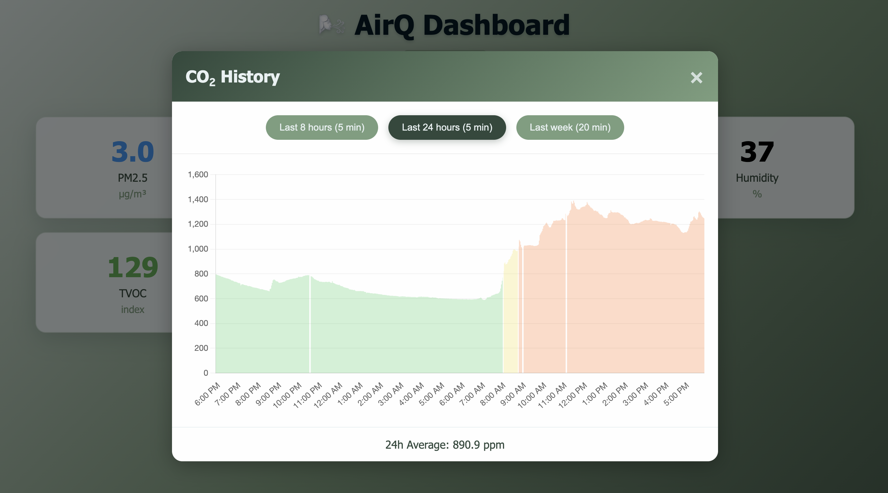
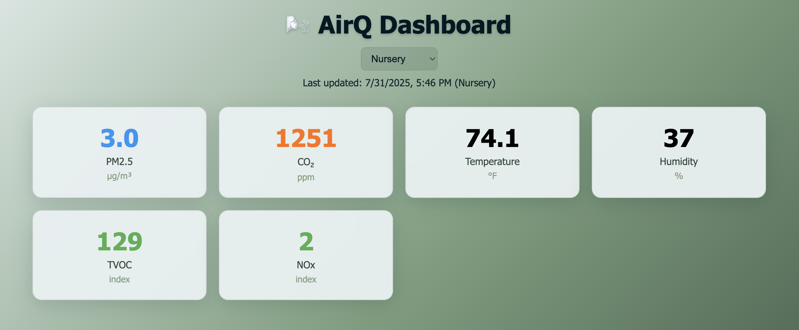

# AirQ Dashboard

A web dashboard for monitoring air quality data from multiple sensors.





## Features

- Real-time air quality monitoring (PM2.5, CO2, temperature, humidity, NOx, TVOC)
- Multi-device support with database-driven configuration
- Historical data visualization with interactive charts
- CLI-based device management
- Responsive web interface

## Quick Start

### Local Development

1. Install dependencies:
```bash
pip install -r requirements.txt
```

2. Initialize database:
```bash
flask init-db
```

3. Add your air quality device:
```bash
flask device add airgradient "Living Room" \
  --token your-api-token \
  --location your-location-id \
  --validate
```

4. Start the application:
```bash
python app.py
```

Visit http://localhost:5001 to view the dashboard.

### Server Deployment

1. Set up your `.env` file:
```bash
SECRET_KEY=your-random-secret-key
DATABASE_PATH=/var/db/airq.db
```

2. Deploy code to server (configure `deploy.sh` with your server details):
```bash
./deploy.sh
```

3. Copy systemd and nginx configuration files to appropriate locations

4. Initialize database on the server:
```bash
ssh your-server
cd /var/www/airq
sudo mkdir -p /var/db
sudo chown www-data:www-data /var/db
sudo chmod 775 /var/db
sudo -u www-data venv/bin/flask init-db
```

5. Add devices via CLI:
```bash
sudo -u www-data venv/bin/flask device add airgradient "Bedroom" \
  --token your-api-token \
  --location your-location-id \
  --validate
```

## Device Management

### Add a device
```bash
flask device add airgradient "Device Name" \
  --token API_TOKEN \
  --location LOCATION_ID \
  --validate
```

### List devices
```bash
flask device list              # Show only active devices
flask device list --all        # Show all devices (active and inactive)
```

### Test device connection
```bash
flask device test DEVICE_ID
```

### Deactivate a device
```bash
flask device deactivate DEVICE_ID        # With confirmation prompt
flask device deactivate DEVICE_ID --force # Skip confirmation
```
Stops data collection but preserves historical data.

### Activate a device
```bash
flask device activate DEVICE_ID
```
Resume data collection for a previously deactivated device.

### Remove a device
```bash
flask device remove DEVICE_ID
```
Permanently deletes the device and all its data.

## Supported Providers

- **airgradient**: AirGradient sensors via their cloud API

## Configuration

The application uses environment variables for configuration:

- `DATABASE_PATH`: Location of SQLite database file (default: `./airq.db`)
- `SECRET_KEY`: Flask secret key for sessions

Device configuration (API tokens, location IDs) is managed through the CLI and stored in the database.

## Requirements

- Python 3.8+
- SQLite
- Internet connection for fetching sensor data

## Development

The application consists of:
- `app.py`: Main Flask application with built-in CLI commands
- Device adapters for different sensor providers  
- SQLite database for device configuration and measurements

## License

This project is licensed under the MIT License - see the [LICENSE](LICENSE) file for details.